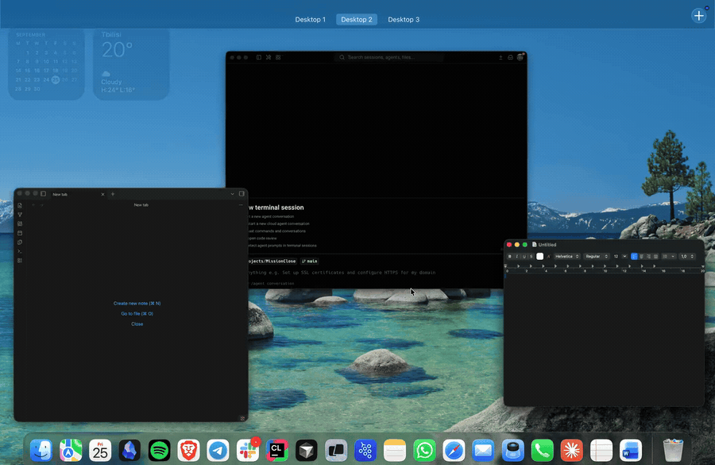

<h1 align="center">MissionClose</h1>

<p align="center">
  <b>Close windows straight from Mission Control on macOS.</b><br>
  <a href="https://beqaabu.github.io/MissionClose">Website</a> ·
  <a href="../../releases/latest">Download</a> ·
  <a href="#install">Install</a> ·
  <a href="#how-it-works">How it works</a>
</p>

<p align="center">
  <a href="https://github.com/beqaabu/MissionClose/actions/workflows/ci.yml"></a>
  <a href="../../releases/latest"></a>
  
  
</p>



Mission Control shows every window you have open, but won't let you touch them. To close one you have to
open it first, hit its red button, then swipe up again.

MissionClose puts the traffic lights on the thumbnails. Swipe up with three fingers (or press <kbd>F3</kbd> /
<kbd>⌃↑</kbd>), hover a window, and click.

| Action | Click | Keyboard (while hovering) |
| --- | --- | --- |
| Close the window | **✕** | <kbd>⌘W</kbd> |
| Minimize it | **−** | <kbd>⌘M</kbd> |
| Full screen | **⤢** | — |
| Quit the whole app | <kbd>⌥</kbd> + **✕** (the ✕ becomes **⏻**) | <kbd>⌘Q</kbd> |
| Close the app's *other* windows | — | <kbd>⌘⌥W</kbd> |

The buttons stay hidden until Mission Control has settled and your fingers are off the trackpad, so they
never flicker mid-swipe or catch a stray click.

## Install

```sh
brew install --cask beqaabu/tap/missionclose
```

Or download `MissionClose.zip` from [the latest release](../../releases/latest), unzip it, and drag
**MissionClose.app** to your Applications folder.

On first launch you'll need to clear two hurdles, once each:

1. **"Apple could not verify…"** — MissionClose isn't notarized (an Apple Developer account costs $99/year,
   which is steep for a free utility). Open **System Settings → Privacy & Security**, scroll down and click
   **Open Anyway**. Or run `xattr -dr com.apple.quarantine /Applications/MissionClose.app` beforehand.
2. **Accessibility access** — approve the prompt, or add MissionClose under
   **System Settings → Privacy & Security → Accessibility**. Without it the buttons never appear.

MissionClose then lives in the menu bar and starts at login.

## Settings

All from the menu bar icon:

| Setting | Options |
| --- | --- |
| **Button Corner** | Top left or top right of the thumbnail |
| **Button Size** | Small, medium or large |
| **Show Buttons** | Only on the hovered window, or on all of them |
| **Confirm Before Quitting Apps** | First <kbd>⌥</kbd>-click arms the button, a second within 3 seconds quits |
| **Launch at Login** | On by default |

## Privacy

MissionClose makes no network connections at all: no analytics, no update checks, no crash reporting.
Accessibility access lets it read the position and title of Mission Control's thumbnails and press a
window's own buttons. It doesn't read window contents or keystrokes. The only thing it stores is your
settings, in `~/Library/Preferences/com.beqa.MissionClose.plist`.

## Uninstall

```sh
brew uninstall --cask beqaabu/tap/missionclose
```

Or quit it from the menu bar, drag the app to the Trash, and remove its entry from
**System Settings → Privacy & Security → Accessibility**. To drop the settings too:
`defaults delete com.beqa.MissionClose`.

## Troubleshooting

**No buttons appear.** Check the menu bar icon: it says whether Accessibility access is granted. After
installing a new version you may have to remove the old entry in System Settings and add it again.

**A button beeps instead of acting.** MissionClose couldn't work out which window the thumbnail belongs
to. [Open an issue](../../issues) with the app and window title, and it'll get fixed.

**The buttons show up mid-swipe, or linger after one.** Tell me what gesture and hardware (trackpad, mouse,
keyboard shortcut, hot corner), since the timing is inferred rather than reported by macOS.

## How it works

macOS has no public API for Mission Control, so MissionClose works from the outside:

- **Is Mission Control open?** While it's on screen, the Dock's accessibility tree contains a group with the
  identifier `mc`, whose buttons are the window thumbnails, with their on-screen frames and titles.
- **When to show the buttons.** Nothing reports that Mission Control finished animating, so the app waits
  until no thumbnail has moved for two polls and no three-finger swipe is in progress, which it tracks from
  trackpad touch events.
- **Catching clicks.** Mission Control handles mouse clicks itself, so floating buttons never receive them.
  A session event tap, enabled only while Mission Control is open, sees clicks first and swallows the ones
  that land on a button.
- **Acting on the window.** The thumbnail is matched to a real window by title (with fallbacks for titles
  that don't match exactly, plus aspect ratio as a tie-breaker), and that window's own close, minimize or
  full-screen button is pressed through the accessibility API.

One dead end worth recording: macOS sends private "dock swipe" events (type 30) that carry a gesture's phase
and progress, which would be a perfect signal. But any event tap on that type, even a listen-only one, stops
an auto-hidden Dock from sliding up on hover. Hence the finger counting.

## Limitations

- It leans on undocumented details of how the Dock exposes Mission Control, so a macOS update could break it.
  Built and tested on macOS 26.
- Two windows with the same title in different apps can occasionally be confused; aspect ratio breaks the tie.
- Mission Control's main view only shows windows on the current Space, so others can't be reached from there.
- Full screen has to leave Mission Control first, because macOS aborts the transition otherwise.

## Contributing

Issues and pull requests are welcome. See [CONTRIBUTING.md](CONTRIBUTING.md) for building from source,
the code layout, and how releases are cut.

## License

MIT. See [LICENSE](LICENSE).

Mission Control and macOS are trademarks of Apple Inc. MissionClose is not affiliated with Apple.
